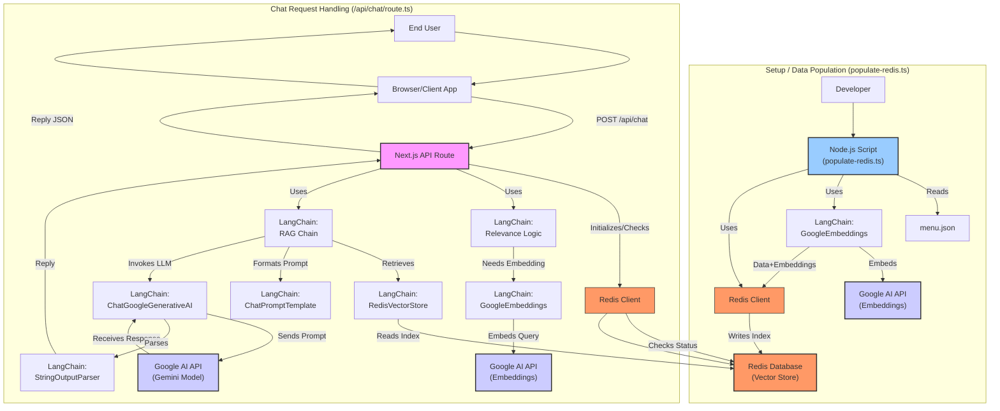
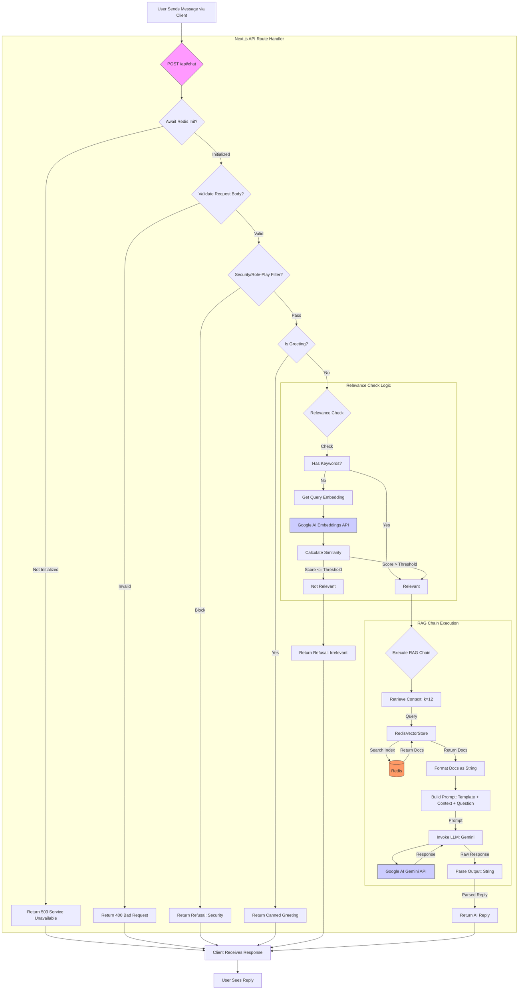

# Lock Chun Cuisine Chatbot

This project implements a chatbot backend for "Lock Chun Chinese Cuisine" using a Next.js API route. It leverages Retrieval-Augmented Generation (RAG) with LangChain.js, Google Generative AI (Gemini and Embeddings), and Redis as a vector store to answer user questions specifically about the restaurant's menu, hours, location, ordering, and reservations.

## Features

*   **Restaurant-Specific:** Answers questions only within the scope of Lock Chun Chinese Cuisine.
*   **Contextual Answers (RAG):** Retrieves relevant menu sections from a vector database (Redis) to provide accurate, grounded answers about menu items and prices.
*   **Relevance Gate:** Filters out off-topic questions using a multi-layered approach (greetings, keywords, semantic similarity).
*   **Specific Rules Handling:** Provides exact, pre-defined answers for common queries like hours, location, reservation policy, and ordering details when not directly found in the menu context.
*   **Greeting Support:** Recognizes and responds to common greetings.
*   **Basic Security Filter:** Attempts to block requests asking the bot to act outside its defined role or ignore instructions.
*   **Data Population Script:** Includes a script to process a `menu.json` file, generate embeddings, and populate the Redis vector store.

## Technology Stack

*   **Framework:** Next.js (for the API route)
*   **Language:** TypeScript
*   **Orchestration:** LangChain.js (`@langchain/core`, `@langchain/google-genai`, `@langchain/redis`)
*   **LLM:** Google Generative AI (Gemini 1.5 Flash via `ChatGoogleGenerativeAI`)
*   **Embeddings:** Google Generative AI (`text-embedding-004` via `GoogleGenerativeAIEmbeddings`)
*   **Vector Store:** Redis (via `@langchain/redis` and `redis` client)
*   **Environment Variables:** `dotenv`
*   **Runtime:** Node.js (for the population script and Next.js backend)

## How It Works & Design Decisions

This project follows a Retrieval-Augmented Generation (RAG) pattern to create a knowledgeable and focused chatbot. The process involves an offline data preparation step and an online request handling step.

### Visual Overview

**(Diagram 1: High-Level Technology Interaction)**



### 1. Data Preparation (Offline Process - `scripts/populate-redis.ts`)

*   **Input:** Reads structured data from `public/menu.json`.
*   **Processing:**
    *   Formats items within each menu *section* into a single text block. Grouping by section provides coherent chunks of context.
    *   Each section becomes a LangChain `Document`.
*   **Embedding:** Converts each document's text into a numerical vector using Google's `text-embedding-004` model. (See "Role of Embeddings" below).
*   **Storage:** Stores the text, metadata, and corresponding vector for each document in a Redis vector index using `RedisVectorStore.fromDocuments`.
*   **Why this approach?** Storing embeddings of menu sections allows the bot to retrieve the most relevant part of the menu based on semantic meaning.

### 2. Chat Request Handling (Online Process - `/app/api/chat/route.ts`)

**(Diagram 2: Detailed API Route Flow)**



**Flow Steps:**

1.  **Initialization & Validation:** Check Redis readiness and validate input.
2.  **Security/Role-Play Filter:** Block attempts to manipulate the bot's persona.
3.  **Greeting Shortcut:** Handle simple greetings efficiently.
4.  **Relevance Gate:**
    *   Check for keywords (fast).
    *   If no keywords, use **semantic similarity** via embeddings (slower but catches more nuance). Embed user query, compare to anchor embedding, check threshold.
    *   Refuse if irrelevant.
5.  **RAG Execution (if relevant):**
    *   **Retrieve:** Use query embedding to find the top `k` similar menu sections from Redis (vector search).
    *   **Augment:** Format retrieved text and inject it (`{context}`) along with the user's query (`{question}`) into the system prompt (`ragPromptTemplate`). The prompt guides the LLM and includes fallback rules.
    *   **Generate:** Send the augmented prompt to the Gemini LLM.
    *   **Parse:** Extract the text response.
6.  **Response:** Send the final reply (AI-generated or pre-canned refusal/greeting) to the user.

### Role of Embeddings (Google `text-embedding-004`)

Embeddings are numerical representations (vectors) of text that capture semantic meaning. Texts with similar meanings have vectors that are "close" together mathematically. Google's `text-embedding-004` model creates these vectors. They are critical for:

1.  **Semantic Storage (in `populate-redis.ts`):**
    *   Each menu section's text is converted into a vector and stored in Redis. This allows searching based on meaning, not just exact words.
2.  **Semantic Relevance Check (in `api/chat`):**
    *   The user's query is embedded.
    *   This query vector is compared to an "anchor" vector representing the bot's intended scope ("Lock Chun food, hours, location...").
    *   High similarity means the query is likely relevant, even without specific keywords.
3.  **Semantic Retrieval for RAG (in `api/chat`):**
    *   The user's query embedding is used to search Redis.
    *   Redis finds the stored menu sections whose vectors are most similar (closest) to the query vector.
    *   This ensures the most relevant menu context is retrieved to help the LLM answer accurately.

### Why RAG?

LLMs like Gemini lack specific, up-to-date knowledge (like Lock Chun's menu). RAG overcomes this:

1.  **Retrieves** relevant facts (menu sections) from an external source (Redis).
2.  **Augments** the LLM's prompt with these facts.
3.  **Generates** an answer grounded in the provided facts.

This dramatically increases accuracy and relevance for domain-specific chatbots.

### Why LangChain?

LangChain.js acts as an orchestration framework:

*   **Abstraction:** Provides standard interfaces for LLMs, Embeddings, Vector Stores, Prompts, Parsers.
*   **Composability:** `RunnableSequence` chains components together logically (Retrieve -> Format -> Prompt -> LLM -> Parse), making the RAG flow manageable and readable.
*   **Integrations:** Offers pre-built connections to services like Google AI and Redis.
*   **Helpers:** Provides utility functions (`formatDocumentsAsString`).

It provides the structure to build applications *around* LLMs efficiently.

### Why Redis as a Vector Store?

*   **Performance:** Fast in-memory operations speed up vector similarity searches.
*   **Persistence:** Data (embeddings, text) survives application restarts.
*   **Vector Search:** RediSearch module provides necessary vector indexing and search capabilities.
*   **Mature & Scalable:** Well-supported and scalable database.
*   **LangChain Integration:** Dedicated `@langchain/redis` package.

## Setup & Installation

1.  **Clone the repository:**
    ```bash
    git clone <your-repo-url>
    cd <your-repo-directory>
    ```
2.  **Install dependencies:**
    ```bash
    npm install
    # or yarn install / pnpm install
    ```
3.  **Set up Environment Variables:**
    Create `.env.local` in the project root:
    ```env
    # Get from Google AI Studio or Google Cloud Console
    GOOGLE_API_KEY="YOUR_GOOGLE_API_KEY"

    # Get from your Redis provider (e.g., Redis Cloud, Upstash, self-hosted)
    # Format: redis[s]://[[username][:password]@][host][:port][/db-number]
    REDIS_URL="YOUR_REDIS_CONNECTION_URL"
    ```
    *   Ensure `GOOGLE_API_KEY` has Generative Language API access.
    *   Ensure Redis has the RediSearch module enabled if needed.

## Running the Project

1.  **Populate the Redis Vector Store (Run once or when menu changes):**
    *   Ensure `public/menu.json` is present and correct.
    *   Run from the project root:
        ```bash
        npm run populate-redis
        # or: npx tsx ./scripts/populate-redis.ts
        ```
2.  **Run the Next.js Development Server:**
    ```bash
    npm run dev
    # or yarn dev / pnpm dev
    ```
3.  **Interact with the API (POST requests to `/api/chat`):**
    *   **Example using `curl`:**
        ```bash
        # Ask about menu
        curl -X POST http://localhost:3000/api/chat \
             -H "Content-Type: application/json" \
             -d '{"message": "What soups do you have?"}'

        # Ask about hours (uses specific rule)
        curl -X POST http://localhost:3000/api/chat \
             -H "Content-Type: application/json" \
             -d '{"message": "What are your hours?"}'

        # Greeting
        curl -X POST http://localhost:3000/api/chat \
             -H "Content-Type: application/json" \
             -d '{"message": "Hi there"}'

        # Off-topic (should be refused)
        curl -X POST http://localhost:3000/api/chat \
             -H "Content-Type: application/json" \
             -d '{"message": "Tell me about the history of china"}'
        ```

## Potential Improvements

*   **Frontend UI:** Build a chat interface.
*   **Conversation History:** Add memory for follow-up questions.
*   **Error Handling:** More specific error handling/retries.
*   **Advanced Relevance:** Fine-tune relevance threshold/model.
*   **Streaming Responses:** Implement response streaming.
*   **Testing:** Add unit and integration tests.
*   **Configuration:** Externalize constants (index name, k value, threshold).